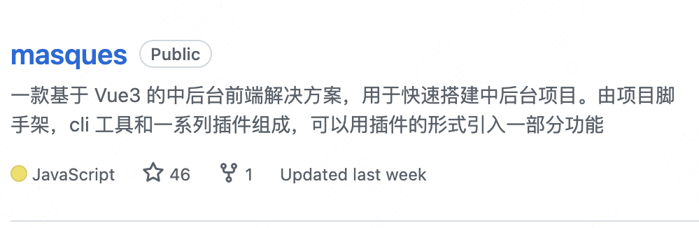

<h1>撒冷才不是小小蒙のGithub</h1>

##  🙋 Hello！

✍️&nbsp;&nbsp;大家好，我是小小蒙! 目前就读于太原理工大学软件工程专业大三，正在为成为一名正式的前端工程师而不断努力!

&emsp;&emsp;The front end is the messenger of communication with the world.

&emsp;&emsp;前端，与世界沟通的使者。

&emsp;&emsp;大一加入了<a style="color:rgb(30,128,255)" herf='https://baike.baidu.com/item/%E4%BA%91%E9%A1%B6%E4%B9%A6%E9%99%A2/23672117'>太原理工大学云顶书院</a>五期前端方向，从此走上了学习前端的不归路，距今已有两年时间

## ✍️开源项目

## 💪 技能树: 

<!-- Gif -->

  
  
  
  
  
  
  
  

##  🧠 学习计划

试图逃离日复一日的切图/调接口生活，最近的学习计划是看看Vue的源码，学习一下go语言！

##  🏆 数据统计
<!-- GitHub奖杯🏆 -->

 

<!-- GitHub数据统计 -->

  
  

 

## 🤹‍♀️ 联系方式：

QQ:3094969938

微信：ytm15364577709

 

